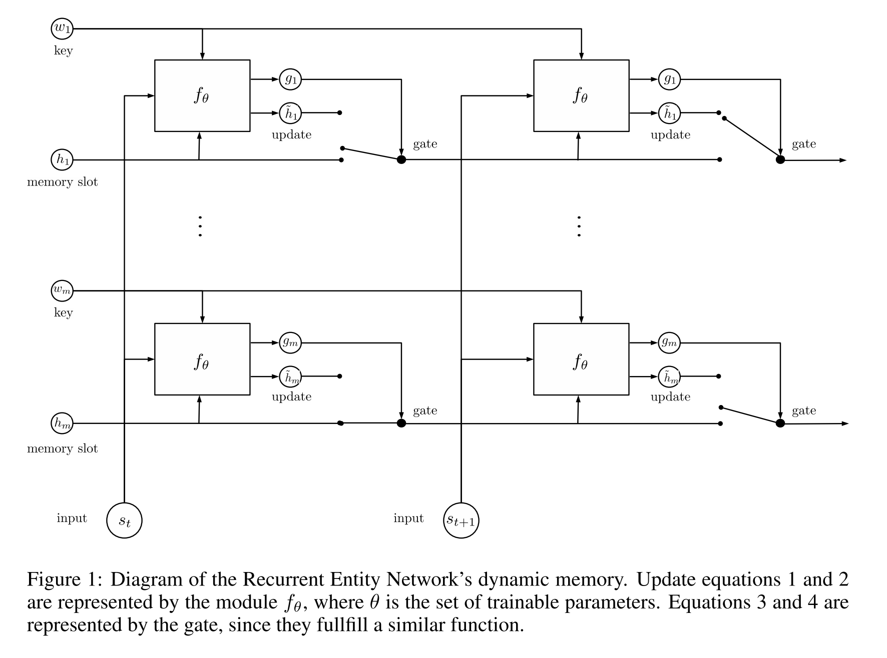

# Recurrent Entity Networks

This repository contains a TensorFlow implementation of recurrent entity networks from [Tracking the World State with
Recurrent Entity Networks](https://openreview.net/forum?id=rJTKKKqeg). This paper introduces the first method to solve all of the bAbI tasks using 10k training examples. Thanks to Mikael Henaff for answering questions about their paper over Thanksgiving break. :)

## Results

Task | EntNet (paper) | EntNet (repo)
--- | --- | ---
1: 1 supporting fact | 0 | 0
2: 2 supporting facts | 0.1 | ?
3: 3 supporting facts | 4.1 | ?
4: 2 argument relations | 0 | ?
5: 3 argument relations | 0.3 | ?
6: yes/no questions | 0.2 | ?
7: counting | 0 | ?
8: lists/sets | 0.5 | ?
9: simple negation | 0.1 | ?
10: indefinite knowledge | 0.6 | ?
11: basic coreference | 0.3 | 0
12: conjunction | 0 | 0
13: compound coreference | 1.3 | 0
14: time reasoning | 0 | ?
15: basic deduction | 0 | ?
16: basic induction | 0.2 | ?
17: positional reasoning | 0.5 | 1.7
18: size reasoning | 0.3 | ?
19: path finding | 2.3 | ?
20: agents motivation | 0 | 0.2
**Failed Tasks** | 0 | ?
**Mean Error** | 0.5 | ?

## Setup

1. Download the datasets by running [download_datasets.sh](download_datasets.sh) or from [The bAbI Project](https://research.facebook.com/research/babi/).
2. Run [prep_datasets.py](prep_datasets.py) which will convert the datasets into [TFRecords](https://www.tensorflow.org/versions/r0.11/how_tos/reading_data/index.html#standard_tensorflow_format).
3. Run `python -m entity_networks.main` to begin training on QA1.
4. Run `./run_all.sh` to train on all tasks.

## Dependencies

- TensorFlow v0.11
